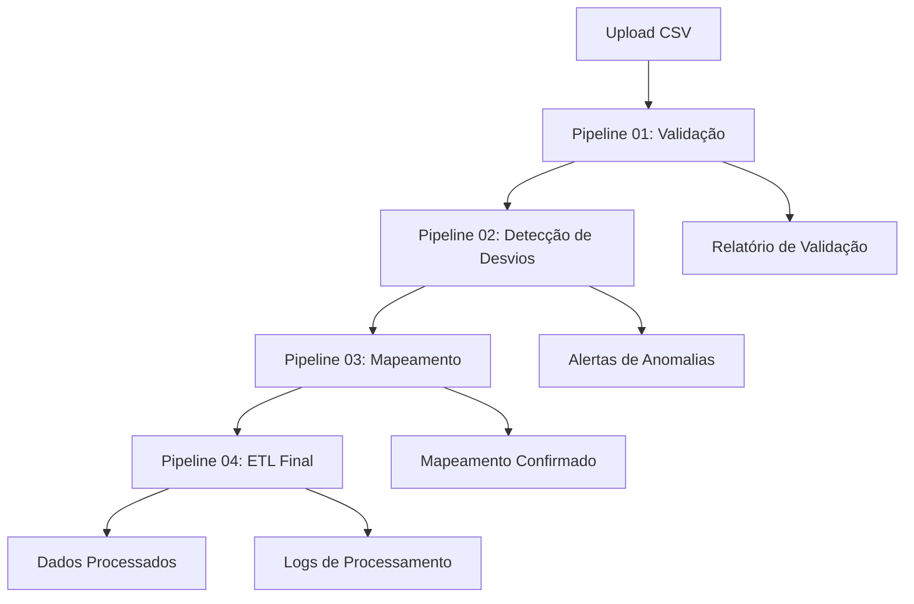

# Sistema ETL Conecta Boi

Bem-vindo à documentação oficial do **Sistema ETL Conecta Boi** - uma plataforma avançada para processamento, validação e análise de dados de pecuária com pipelines ETL inteligentes e monitoramento em tempo real.

## =€ Início Rápido

### Para Desenvolvedores
- [**API Reference**](api/typedoc/) - Documentação completa da API
- [**Guias de Pipeline**](pipeline-flows/overview) - Entenda a arquitetura dos pipelines
- [**Configuração Local**](README#configuração-e-deploy) - Setup do ambiente de desenvolvimento

### Para Operadores
- [**Manual Operacional**](operations/runbook) - Procedimentos e troubleshooting
- [**Scripts de Manutenção**](maintenance/sql-scripts) - Scripts SQL para manutenção
- [**Monitoramento**](README#métricas-e-kpis) - KPIs e alertas do sistema

### Para Analistas de Dados
- [**Regras de Validação**](mappings/validation-rules) - Validações aplicadas nos dados
- [**Mapeamento de Campos**](mappings/header-mappings) - Como os dados são mapeados
- [**Transformações**](mappings/transformation-logic) - Lógica de enriquecimento

## <× Arquitetura do Sistema

O Sistema ETL Conecta Boi é composto por **4 pipelines especializados**:

| Pipeline | Função | Status |
|----------|--------|---------|
| **Pipeline 01** | [Base e Validação](pipeline-flows/pipeline01-base) |  Ativo |
| **Pipeline 02** | [Detecção de Desvios](pipeline-flows/pipeline02-desvios) |  Ativo |
| **Pipeline 03** | [Mapeamento de Headers](pipeline-flows/pipeline03-mapping) |  Ativo |
| **Pipeline 04** | [ETL Principal](pipeline-flows/pipeline04-etl) |  Ativo |

### Fluxo de Dados

## =Ê Dashboard de Métricas

| Métrica | Valor Atual | Objetivo |
|---------|-------------|----------|
| **Uptime** | 99.95% | > 99.9% |
| **Throughput** | 8,500 reg/min | > 10,000 reg/min |
| **Precisão Validação** | 97.3% | > 95% |
| **Tempo Médio Processamento** | 18s | < 30s |

## =
 Recursos Principais

### ( Processamento Inteligente
- **Validação automática** com 50+ regras de negócio
- **Mapeamento fuzzy** para headers com variações
- **Detecção de anomalias** usando machine learning
- **Retry logic** com exponential backoff

### =È Monitoramento e Alertas
- **Dashboard em tempo real** com métricas essenciais
- **Sistema de alertas** via múltiplos canais
- **Rastreamento de erros** com Sentry
- **Logs estruturados** para auditoria

### =' Operação e Manutenção
- **Health checks** automáticos
- **Scripts de manutenção** para otimização
- **Backup e recovery** de dados críticos
- **Runbook completo** para emergências

## =à Stack Tecnológico

- **Frontend**: React 18, TypeScript, TailwindCSS
- **Backend**: Supabase (PostgreSQL, Auth, Edge Functions)
- **Monitoramento**: Sentry, Custom Metrics Dashboard
- **Documentation**: TypeDoc, Jekyll (GitHub Pages)

## =Ú Documentação Completa

Explore toda a documentação:

- [=Ö **Visão Geral Completa**](README) - Índice de toda a documentação
- [<× **Arquitetura e Pipelines**](pipeline-flows/) - Detalhes técnicos dos pipelines
- [= **Mapeamentos e Transformações**](mappings/) - Como os dados são processados
- [=à **Operações e Manutenção**](operations/) - Guias operacionais
- [=Ê **API e Código**](api/typedoc/) - Referência técnica completa

---

## =Þ Suporte

- **Documentação Técnica**: [API Reference](api/typedoc/)
- **Emergências**: Consulte o [Runbook Operacional](operations/runbook)
- **Issues**: [GitHub Issues](https://github.com/your-org/conecta-boi/issues)

> **Última atualização**: {{ site.time | date: "%d/%m/%Y" }}
> **Versão**: 1.0.0
> **Status**:  Operacional