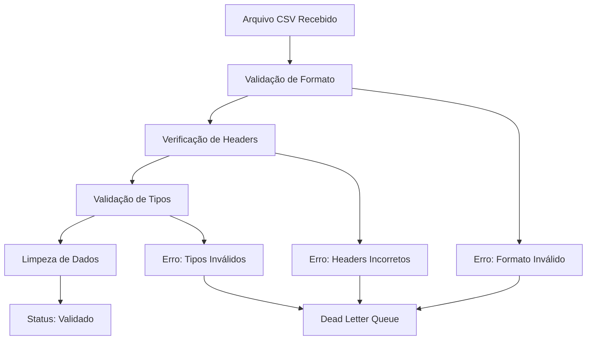
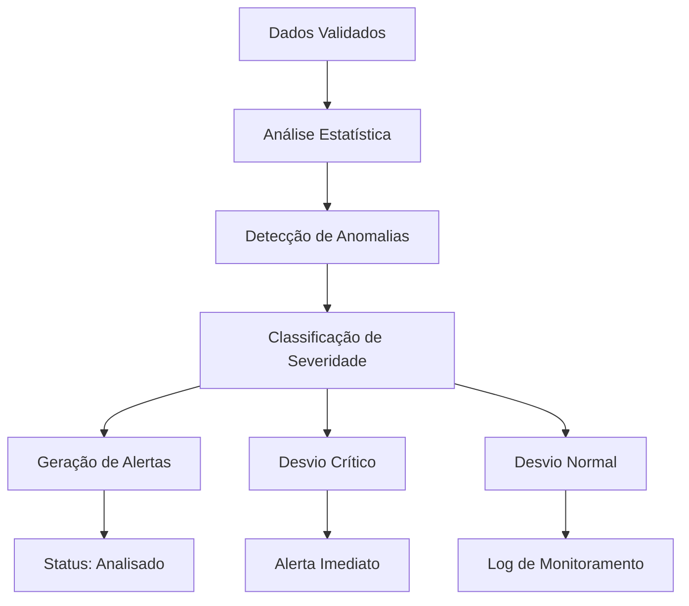
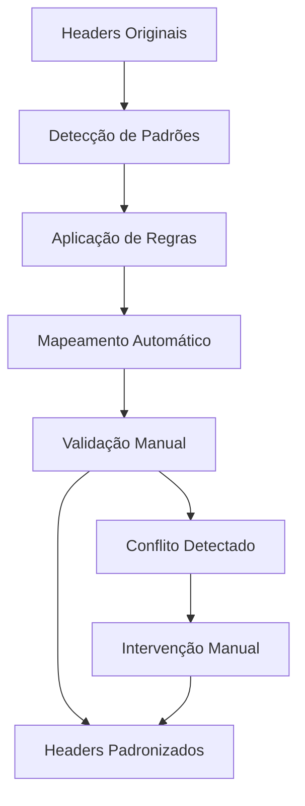
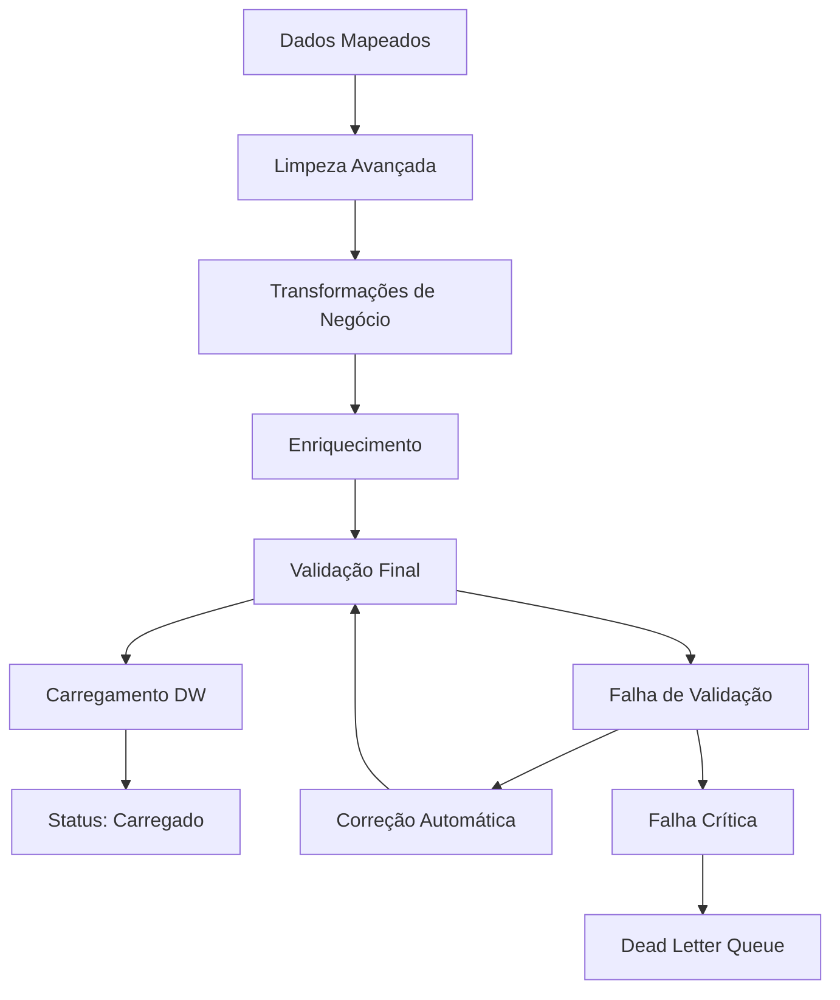
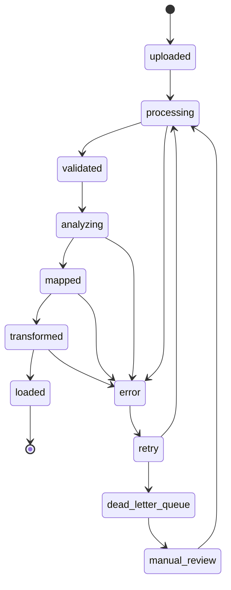

# Visão Geral dos Pipelines ETL

## 🏗️ Arquitetura dos Pipelines

O sistema ETL da Conecta Boi é composto por 4 pipelines principais que trabalham em sequência para processar dados de alimentação de gado. Cada pipeline tem uma responsabilidade específica e pode ser executado independentemente para facilitar manutenção e debugging.

## 📋 Pipeline 01: Base e Validação de Dados

**Responsabilidade**: Validação inicial e limpeza de dados brutos

### Funcionalidades Principais
- Validação de formato de arquivo (CSV)
- Verificação de encoding e delimitadores
- Validação de schemas obrigatórios
- Detecção de dados corrompidos
- Normalização de tipos de dados

### Fluxo de Processamento


### Estados do Arquivo
- `uploaded`: Arquivo recebido
- `validating`: Em processo de validação
- `validated`: Validação concluída com sucesso
- `validation_failed`: Falha na validação

### Métricas Coletadas
- Tempo de validação por arquivo
- Taxa de aprovação/rejeição
- Tipos de erros mais comuns
- Volume de dados processados

---

## 🔄 Pipeline 02: Desvios de Carregamento

**Responsabilidade**: Detecção e análise de desvios nos dados de alimentação

### Funcionalidades Principais
- Detecção de desvios em relação aos padrões históricos
- Análise estatística de anomalias
- Classificação de desvios por severidade
- Geração de alertas automáticos

### Algoritmos de Detecção
1. **Desvio de Volume**: Variação significativa na quantidade de alimento
2. **Desvio de Timing**: Alterações nos horários de alimentação
3. **Desvio de Qualidade**: Inconsistências nos dados nutricionais
4. **Desvio de Padrão**: Mudanças nos padrões de alimentação

### Fluxo de Processamento


### Tipos de Desvio
- **Crítico**: Requer intervenção imediata
- **Alto**: Monitoramento próximo necessário
- **Médio**: Atenção recomendada
- **Baixo**: Variação dentro do esperado

---

## 🗺️ Pipeline 03: Mapeamento de Headers

**Responsabilidade**: Padronização e mapeamento de cabeçalhos de diferentes fontes

### Funcionalidades Principais
- Mapeamento automático de headers variáveis
- Padronização de nomenclatura
- Resolução de conflitos de nomes
- Criação de aliases para campos

### Sistema de Mapeamento


### Regras de Mapeamento
1. **Correspondência Exata**: Nome idêntico
2. **Correspondência Fuzzy**: Similaridade > 85%
3. **Correspondência por Alias**: Nomes alternativos conhecidos
4. **Correspondência por Padrão**: Regex para formatos variáveis

---

## ⚙️ Pipeline 04: ETL Principal

**Responsabilidade**: Transformação final e carregamento no data warehouse

### Funcionalidades Principais
- Transformações de dados complexas
- Enriquecimento com dados externos
- Validação de integridade referencial
- Carregamento incremental/completo
- Controle de versão de dados

### Etapas de Transformação


### Tipos de Transformação
- **Limpeza**: Remoção de caracteres especiais, normalização
- **Agregação**: Cálculos de médias, totais, percentuais
- **Enriquecimento**: Adição de dados de contexto
- **Particionamento**: Divisão por data, região, tipo

---

## 🔄 Estado Machine Integrado

Todos os pipelines utilizam uma máquina de estados compartilhada para gerenciar o ciclo de vida dos dados:



## 📊 Métricas e Monitoramento

### Métricas Globais
- **Throughput**: Arquivos processados por hora
- **Latência**: Tempo médio end-to-end
- **Taxa de Sucesso**: Percentual de arquivos processados com sucesso
- **Taxa de Erro**: Percentual de falhas por pipeline

### Alertas Configurados
- Pipeline parado por > 30 minutos
- Taxa de erro > 10%
- Dead Letter Queue > 100 entradas
- Tempo de processamento > SLA (2 horas)

### Dashboards
- **Operacional**: Status em tempo real, alertas ativos
- **Análise**: Tendências históricas, performance
- **Negócio**: Métricas de qualidade de dados, insights

## 🛠️ Configuração e Deployment

### Variáveis de Ambiente
```bash
# Database
SUPABASE_URL=https://your-project.supabase.co
SUPABASE_ANON_KEY=your-anon-key

# Monitoring
SENTRY_DSN=https://your-sentry-dsn
PROMETHEUS_ENDPOINT=http://prometheus:9090

# ETL Configuration
ETL_BATCH_SIZE=1000
ETL_RETRY_ATTEMPTS=3
ETL_TIMEOUT_MINUTES=120
```

### Recursos Necessários
- **CPU**: 4 cores mínimo (8 cores recomendado)
- **RAM**: 8GB mínimo (16GB recomendado)
- **Storage**: 100GB para dados temporários
- **Network**: 1Gbps para transfer de arquivos grandes

## 🔍 Troubleshooting Comum

### Pipeline Travado
1. Verificar logs do container
2. Validar conectividade com banco
3. Confirmar recursos disponíveis
4. Restart do serviço se necessário

### Erros de Validação
1. Revisar formato do arquivo de entrada
2. Verificar mapeamento de headers
3. Validar tipos de dados
4. Consultar regras de negócio

### Performance Degradada
1. Monitorar uso de CPU/RAM
2. Verificar queries lentas no banco
3. Analisar volume de dados
4. Considerar scaling horizontal

---

**Próximos Passos**:
- [Pipeline 01 - Detalhes](pipeline01-base.md)
- [Pipeline 02 - Detalhes](pipeline02-desvios.md)
- [Pipeline 03 - Detalhes](pipeline03-mapping.md)
- [Pipeline 04 - Detalhes](pipeline04-etl.md)