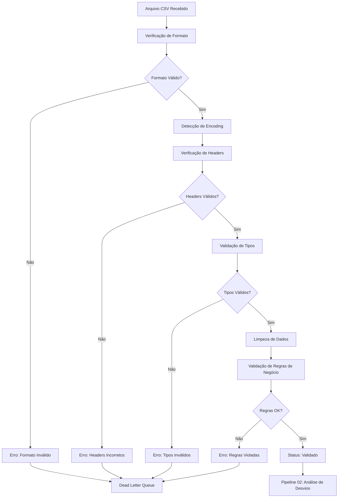

# Pipeline 01: Base e Validação de Dados

## 🎯 Objetivo

O Pipeline 01 é responsável pela primeira etapa de processamento dos dados ETL da Conecta Boi. Sua função principal é validar, limpar e preparar os dados brutos recebidos em formato CSV para as etapas subsequentes do processamento.

## 📊 Responsabilidades

### Validação de Entrada
- Verificação de formato de arquivo (CSV)
- Validação de encoding (UTF-8, ISO-8859-1)
- Detecção de delimitadores (vírgula, ponto-e-vírgula, tab)
- Verificação de integridade do arquivo

### Validação de Schema
- Verificação de headers obrigatórios
- Validação de tipos de dados por coluna
- Verificação de constraints de negócio
- Detecção de valores nulos em campos obrigatórios

### Limpeza e Normalização
- Remoção de caracteres especiais
- Padronização de formatos de data
- Normalização de valores numéricos
- Correção de encoding de caracteres

## 🔄 Fluxo Detalhado



## 📋 Validações Implementadas

### 1. Validação de Formato de Arquivo

```typescript
interface FileValidation {
  isCSV: boolean;
  encoding: 'UTF-8' | 'ISO-8859-1' | 'Windows-1252';
  delimiter: ',' | ';' | '\t';
  hasHeaders: boolean;
  lineCount: number;
  isEmpty: boolean;
}
```

**Critérios de Validação:**
- Extensão deve ser `.csv`
- Arquivo não pode estar vazio
- Primeira linha deve conter headers
- Mínimo de 2 linhas (header + 1 dado)
- Máximo de 1M de linhas por arquivo

### 2. Validação de Headers

**Headers Obrigatórios:**
```yaml
required_headers:
  - id_animal
  - data_pesagem
  - peso_kg
  - id_fazenda
  - id_operador

optional_headers:
  - observacoes
  - temperatura_ambiente
  - umidade
  - id_curral
```

**Regras de Mapeamento:**
- Case-insensitive matching
- Remoção de espaços e caracteres especiais
- Suporte a aliases (ex: "peso" → "peso_kg")

### 3. Validação de Tipos de Dados

```typescript
interface DataTypeValidation {
  id_animal: string;        // Format: alphanumeric, max 50 chars
  data_pesagem: Date;       // ISO 8601 or Brazilian format
  peso_kg: number;          // Positive decimal, max 3 decimal places
  id_fazenda: string;       // UUID or alphanumeric code
  id_operador: string;      // UUID or employee ID
}
```

**Regras de Conversão:**
- Datas: DD/MM/YYYY → ISO 8601
- Números: vírgula → ponto decimal
- Strings: trim + sanitização
- Booleans: 1/0, true/false, sim/não

### 4. Validação de Regras de Negócio

**Regras Críticas:**
- Peso deve estar entre 50kg e 2000kg
- Data não pode ser futura
- ID animal deve existir no sistema
- ID fazenda deve estar ativa
- ID operador deve ter permissão

**Regras de Alerta:**
- Peso muito diferente da última pesagem (>20%)
- Pesagem muito recente (mesmo animal, <24h)
- Operador processando muitos arquivos simultaneamente

## 🛠️ Implementação Técnica

### Serviço Principal

```typescript
// packages/pipeline01-base/src/validation-service.ts
export class ValidationService {
  async validateFile(
    fileBuffer: Buffer,
    filename: string,
    organizationId: string
  ): Promise<ValidationResult> {
    const steps = [
      this.validateFormat,
      this.validateHeaders,
      this.validateData,
      this.validateBusinessRules
    ];

    for (const step of steps) {
      const result = await step(fileBuffer, filename, organizationId);
      if (!result.isValid) {
        return result;
      }
    }

    return { isValid: true, data: cleanedData };
  }
}
```

### Estados do Arquivo

```typescript
type FileStatus =
  | 'uploaded'           // Arquivo recebido
  | 'validating'         // Em processo de validação
  | 'validated'          // Validação concluída com sucesso
  | 'validation_failed'  // Falha na validação
  | 'processing'         // Enviado para Pipeline 02
  | 'error'              // Erro técnico durante processamento
```

### Estrutura de Dados

```sql
-- Tabela principal de arquivos
CREATE TABLE etl_file (
  id UUID PRIMARY KEY DEFAULT gen_random_uuid(),
  organization_id UUID NOT NULL REFERENCES organizations(id),
  filename VARCHAR(255) NOT NULL,
  file_size_bytes BIGINT NOT NULL,
  mime_type VARCHAR(100) NOT NULL,
  status etl_file_status NOT NULL DEFAULT 'uploaded',

  -- Metadados de validação
  validation_started_at TIMESTAMPTZ,
  validation_completed_at TIMESTAMPTZ,
  validation_errors JSONB,
  validation_warnings JSONB,

  -- Estatísticas do arquivo
  total_rows INTEGER,
  valid_rows INTEGER,
  invalid_rows INTEGER,
  headers_detected TEXT[],
  encoding_detected VARCHAR(50),
  delimiter_detected CHAR(1),

  created_at TIMESTAMPTZ NOT NULL DEFAULT NOW(),
  updated_at TIMESTAMPTZ NOT NULL DEFAULT NOW()
);
```

## 📈 Métricas Coletadas

### Métricas de Performance
- **Tempo de validação por arquivo**: Média, P95, P99
- **Throughput**: Arquivos processados por hora
- **Taxa de aprovação**: % de arquivos que passam na validação
- **Taxa de rejeição por tipo**: Breakdown por tipo de erro

### Métricas de Qualidade
- **Distribuição de tamanhos**: Histograma de tamanhos de arquivo
- **Padrões de encoding**: UTF-8 vs outros encodings
- **Tipos de erro mais comuns**: Top 10 erros de validação
- **Tempo médio por etapa**: Breakdown do tempo de processamento

### Alertas Configurados
- Arquivo em validação há mais de 30 minutos
- Taxa de rejeição > 50% (últimas 2 horas)
- Erro técnico em validação
- Arquivo muito grande (>100MB)
- Pico de uploads (>50 arquivos em 10 min)

## 🔧 Configuração e Tunning

### Variáveis de Ambiente

```bash
# Limites de arquivo
MAX_FILE_SIZE_MB=100
MAX_ROWS_PER_FILE=1000000
VALIDATION_TIMEOUT_MINUTES=30

# Configuração de encoding
DEFAULT_ENCODING=UTF-8
FALLBACK_ENCODINGS=ISO-8859-1,Windows-1252

# Validação de negócio
PESO_MIN_KG=50
PESO_MAX_KG=2000
PESAGEM_INTERVALO_MIN_HORAS=24
```

### Performance Tunning

**Para arquivos grandes:**
- Processamento em chunks de 10k linhas
- Validação paralela por coluna
- Cache de regras de validação
- Buffer de escrita para DLQ

**Para alto volume:**
- Pool de workers dedicados
- Queue com priorização
- Rate limiting por organização
- Circuit breaker para falhas

## 🚨 Tratamento de Erros

### Categorização de Erros

**Erros Críticos (Param DLQ):**
- Arquivo corrompido
- Formato inválido
- Headers obrigatórios ausentes
- Dados inconsistentes > 50%

**Erros de Alerta (Log + Notificação):**
- Encoding não padrão
- Dados suspeitos (outliers)
- Headers opcionais ausentes
- Performance degradada

**Erros Transientes (Retry):**
- Timeout de validação
- Erro de conexão com DB
- Erro de memória temporário
- Rate limit atingido

### Dead Letter Queue

```sql
CREATE TABLE etl_dead_letter_queue (
  id UUID PRIMARY KEY DEFAULT gen_random_uuid(),
  entity_type VARCHAR(50) NOT NULL, -- 'file' ou 'run'
  entity_id UUID NOT NULL,
  organization_id UUID NOT NULL,

  error_type VARCHAR(100) NOT NULL,
  error_message TEXT NOT NULL,
  error_details JSONB,

  original_data JSONB,
  retry_count INTEGER DEFAULT 0,
  max_retries INTEGER DEFAULT 3,

  resolved BOOLEAN DEFAULT FALSE,
  resolved_at TIMESTAMPTZ,
  resolved_by UUID REFERENCES users(id),
  resolution_notes TEXT,

  created_at TIMESTAMPTZ NOT NULL DEFAULT NOW()
);
```

## 🔍 Monitoramento e Observabilidade

### Logs Estruturados

```json
{
  "timestamp": "2025-01-16T10:30:00Z",
  "level": "INFO",
  "service": "pipeline01-validation",
  "operation": "validate_file",
  "file_id": "abc-123",
  "organization_id": "org-456",
  "filename": "pesagem_2025_01.csv",
  "duration_ms": 1250,
  "status": "success",
  "metrics": {
    "total_rows": 15430,
    "valid_rows": 15387,
    "invalid_rows": 43,
    "validation_errors": ["peso_invalido", "data_futura"]
  }
}
```

### Dashboards

**Dashboard Operacional:**
- Status atual dos arquivos em validação
- Queue de arquivos aguardando processamento
- Taxa de erro em tempo real
- Performance por organização

**Dashboard de Qualidade:**
- Trends de taxa de aprovação
- Tipos de erro mais frequentes
- Distribuição de tamanhos de arquivo
- Análise de padrões de upload

## 🧪 Testes e Qualidade

### Testes Unitários

```typescript
describe('ValidationService', () => {
  it('should validate valid CSV file', async () => {
    const result = await validationService.validateFile(validCsvBuffer, 'test.csv', 'org-1');
    expect(result.isValid).toBe(true);
  });

  it('should reject file with missing headers', async () => {
    const result = await validationService.validateFile(invalidCsvBuffer, 'test.csv', 'org-1');
    expect(result.isValid).toBe(false);
    expect(result.errors).toContain('missing_required_headers');
  });
});
```

### Testes de Integração

- Upload e validação end-to-end
- Integração com Dead Letter Queue
- Testes de performance com arquivos grandes
- Testes de concorrência

### Casos de Teste

**Arquivos de Teste:**
- `valid_pesagem_small.csv` (100 linhas)
- `valid_pesagem_large.csv` (50k linhas)
- `invalid_headers.csv` (headers incorretos)
- `invalid_data_types.csv` (tipos incorretos)
- `mixed_encoding.csv` (encoding misto)
- `business_rule_violations.csv` (regras violadas)

---

**Próximo Pipeline**: [Pipeline 02 - Desvios de Carregamento](pipeline02-desvios.md)