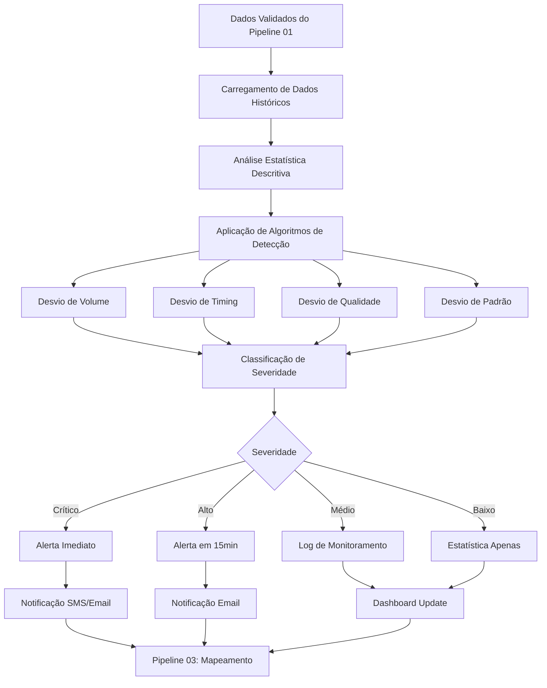

# Pipeline 02: Desvios de Carregamento

## 🎯 Objetivo

O Pipeline 02 analisa os dados validados pelo Pipeline 01 para detectar desvios, anomalias e padrões suspeitos nos dados de alimentação de gado. Utiliza algoritmos estatísticos e machine learning para identificar situações que requerem atenção especial.

## 📊 Responsabilidades

### Detecção de Anomalias
- Identificação de desvios em padrões de alimentação
- Análise estatística de dados históricos
- Detecção de outliers em tempo real
- Classificação de severidade dos desvios

### Análise Temporal
- Comparação com períodos anteriores
- Identificação de tendências
- Análise sazonal
- Detecção de mudanças abruptas

### Geração de Alertas
- Alertas automáticos para desvios críticos
- Categorização por tipo e urgência
- Escalação automática
- Integração com sistemas de notificação

## 🔄 Fluxo Detalhado


```mermaid
flowchart TD
    A[Dados Validados do Pipeline 01] --> B[Carregamento de Dados Históricos]
    B --> C[Análise Estatística Descritiva]
    C --> D[Aplicação de Algoritmos de Detecção]

    D --> E[Desvio de Volume]
    D --> F[Desvio de Timing]
    D --> G[Desvio de Qualidade]
    D --> H[Desvio de Padrão]

    E --> I[Classificação de Severidade]
    F --> I
    G --> I
    H --> I

    I --> J{Severidade}
    J -->|Crítico| K[Alerta Imediato]
    J -->|Alto| L[Alerta em 15min]
    J -->|Médio| M[Log de Monitoramento]
    J -->|Baixo| N[Estatística Apenas]

    K --> O[Notificação SMS/Email]
    L --> P[Notificação Email]
    M --> Q[Dashboard Update]
    N --> Q

    O --> R[Pipeline 03: Mapeamento]
    P --> R
    Q --> R
```

## 🔍 Algoritmos de Detecção

### 1. Desvio de Volume

**Objetivo:** Detectar variações significativas na quantidade de alimento consumido

```typescript
interface VolumeDeviationAnalysis {
  animalId: string;
  currentVolume: number;
  historicalAverage: number;
  standardDeviation: number;
  zScore: number;
  percentileRank: number;
  deviationType: 'increase' | 'decrease' | 'normal';
  severity: 'critical' | 'high' | 'medium' | 'low';
}
```

**Metodologia:**
1. **Baseline Calculation**: Média móvel de 30 dias
2. **Threshold Detection**: Z-score > 2.5 ou < -2.5
3. **Seasonal Adjustment**: Compensação sazonal
4. **Trend Analysis**: Detecção de tendências de 7 dias

```sql
-- Query para análise de desvio de volume
WITH volume_stats AS (
  SELECT
    id_animal,
    AVG(volume_acao) OVER (
      PARTITION BY id_animal
      ORDER BY data_pesagem
      ROWS BETWEEN 30 PRECEDING AND 1 PRECEDING
    ) as baseline_volume,
    STDDEV(volume_acao) OVER (
      PARTITION BY id_animal
      ORDER BY data_pesagem
      ROWS BETWEEN 30 PRECEDING AND 1 PRECEDING
    ) as baseline_stddev,
    volume_acao as current_volume
  FROM etl_processed_data
  WHERE data_pesagem >= CURRENT_DATE - INTERVAL '90 days'
)
SELECT
  id_animal,
  current_volume,
  baseline_volume,
  (current_volume - baseline_volume) / NULLIF(baseline_stddev, 0) as z_score,
  CASE
    WHEN ABS((current_volume - baseline_volume) / NULLIF(baseline_stddev, 0)) > 3 THEN 'critical'
    WHEN ABS((current_volume - baseline_volume) / NULLIF(baseline_stddev, 0)) > 2.5 THEN 'high'
    WHEN ABS((current_volume - baseline_volume) / NULLIF(baseline_stddev, 0)) > 2 THEN 'medium'
    ELSE 'low'
  END as severity
FROM volume_stats
WHERE baseline_stddev > 0;
```

### 2. Desvio de Timing

**Objetivo:** Identificar alterações nos horários e frequência de alimentação

```typescript
interface TimingDeviationAnalysis {
  animalId: string;
  expectedFeedingTime: Date;
  actualFeedingTime: Date;
  timeDifference: number; // em minutos
  frequencyDeviation: number;
  historicalPattern: TimePattern;
  severity: SeverityLevel;
}

interface TimePattern {
  averageInterval: number; // horas entre alimentações
  preferredTimes: Date[]; // horários preferenciais
  consistency: number; // 0-1, where 1 is very consistent
}
```

**Regras de Detecção:**
- Alimentação fora do horário normal (>2h de diferença)
- Intervalo muito longo entre alimentações (>16h)
- Intervalo muito curto entre alimentações (<4h)
- Quebra de padrão estabelecido (>3 dias consecutivos)

### 3. Desvio de Qualidade

**Objetivo:** Detectar problemas na qualidade nutricional dos dados

```typescript
interface QualityDeviationAnalysis {
  nutritionalProfile: {
    protein: number;
    carbohydrates: number;
    fat: number;
    fiber: number;
    minerals: Record<string, number>;
  };
  qualityScore: number; // 0-100
  deviations: QualityDeviation[];
  recommendations: string[];
}

interface QualityDeviation {
  parameter: string;
  expectedRange: [number, number];
  actualValue: number;
  severity: SeverityLevel;
  impact: 'weight_gain' | 'health' | 'cost' | 'efficiency';
}
```

**Análises Implementadas:**
- Balanço nutricional inadequado
- Valores nutricionais extremos
- Inconsistência com prescrição veterinária
- Correlação com indicadores de saúde

### 4. Desvio de Padrão Comportamental

**Objetivo:** Identificar mudanças nos padrões de comportamento alimentar

```typescript
interface BehavioralPatternAnalysis {
  animalId: string;
  behaviorMetrics: {
    feedingDuration: number;
    feedingFrequency: number;
    feedingConsistency: number;
    socialFeedingPattern: boolean;
  };
  patternChanges: PatternChange[];
  correlations: BehaviorCorrelation[];
}

interface PatternChange {
  metric: string;
  changeType: 'gradual' | 'sudden' | 'cyclical';
  changePercent: number;
  timeframe: string;
  possibleCauses: string[];
}
```

## 📊 Classificação de Severidade

### Sistema de Pontuação

```typescript
interface SeverityCalculation {
  baseScore: number;
  modifiers: {
    animalValue: number;      // Valor econômico do animal
    healthHistory: number;    // Histórico de problemas de saúde
    ageGroup: number;        // Grupo etário (jovens = maior peso)
    seasonalFactor: number;   // Fator sazonal
    groupImpact: number;     // Impacto no grupo/curral
  };
  finalScore: number;
  severityLevel: SeverityLevel;
}

type SeverityLevel = 'critical' | 'high' | 'medium' | 'low';
```

### Critérios de Classificação

**Crítico (Score 80-100):**
- Risco imediato à saúde animal
- Desvio > 3 desvios padrão
- Impacto em múltiplos animais
- Valor econômico alto

**Alto (Score 60-79):**
- Tendência preocupante
- Desvio > 2.5 desvios padrão
- Impacto em grupo específico
- Intervenção recomendada em 24h

**Médio (Score 40-59):**
- Monitoramento próximo necessário
- Desvio > 2 desvios padrão
- Impacto localizado
- Revisão em 48h

**Baixo (Score 0-39):**
- Variação dentro do esperado
- Desvio < 2 desvios padrão
- Monitoramento de rotina
- Registro para análise trends

## 🚨 Sistema de Alertas

### Configuração de Alertas

```sql
CREATE TABLE etl_alert_config (
  id UUID PRIMARY KEY DEFAULT gen_random_uuid(),
  organization_id UUID NOT NULL REFERENCES organizations(id),

  alert_type VARCHAR(50) NOT NULL, -- 'volume', 'timing', 'quality', 'pattern'
  severity_threshold VARCHAR(20) NOT NULL, -- 'critical', 'high', 'medium', 'low'

  enabled BOOLEAN DEFAULT TRUE,
  notification_channels TEXT[] DEFAULT ARRAY['email'], -- 'email', 'sms', 'slack', 'webhook'

  escalation_rules JSONB, -- Regras de escalação automática
  business_hours_only BOOLEAN DEFAULT FALSE,

  created_at TIMESTAMPTZ NOT NULL DEFAULT NOW(),
  updated_at TIMESTAMPTZ NOT NULL DEFAULT NOW()
);
```

### Processamento de Alertas

```typescript
export class AlertProcessor {
  async processDeviation(
    deviation: DeviationAnalysis,
    organizationId: string
  ): Promise<AlertResult> {

    // 1. Verificar configuração de alertas
    const alertConfig = await this.getAlertConfig(organizationId, deviation.type);

    if (!this.shouldTriggerAlert(deviation, alertConfig)) {
      return { triggered: false, reason: 'below_threshold' };
    }

    // 2. Criar registro de alerta
    const alert = await this.createAlert({
      organizationId,
      entityType: 'animal',
      entityId: deviation.animalId,
      alertType: deviation.type,
      severity: deviation.severity,
      message: this.generateAlertMessage(deviation),
      metadata: deviation
    });

    // 3. Enviar notificações
    const notifications = await this.sendNotifications(alert, alertConfig);

    // 4. Verificar necessidade de escalação
    await this.checkEscalation(alert, alertConfig);

    return { triggered: true, alertId: alert.id, notifications };
  }

  private generateAlertMessage(deviation: DeviationAnalysis): string {
    const templates = {
      volume: `Animal ${deviation.animalId}: Desvio de volume de ${deviation.percentChange}% detectado`,
      timing: `Animal ${deviation.animalId}: Padrão de alimentação alterado - ${deviation.description}`,
      quality: `Animal ${deviation.animalId}: Problemas de qualidade nutricional detectados`,
      pattern: `Animal ${deviation.animalId}: Mudança comportamental significativa`
    };

    return templates[deviation.type] || 'Desvio detectado';
  }
}
```

## 📈 Métricas e KPIs

### Métricas de Detecção

```sql
-- Métricas de eficácia do sistema de detecção
CREATE VIEW deviation_detection_metrics AS
SELECT
  DATE_TRUNC('day', created_at) as date,
  organization_id,
  deviation_type,
  severity,
  COUNT(*) as total_deviations,
  COUNT(*) FILTER (WHERE confirmed = true) as confirmed_deviations,
  COUNT(*) FILTER (WHERE false_positive = true) as false_positives,
  ROUND(
    COUNT(*) FILTER (WHERE confirmed = true)::decimal /
    NULLIF(COUNT(*), 0) * 100, 2
  ) as accuracy_rate
FROM etl_deviation_analysis
GROUP BY date, organization_id, deviation_type, severity;
```

### Dashboard de Performance

**KPIs Principais:**
- Taxa de detecção de desvios críticos
- Tempo médio entre detecção e resolução
- Taxa de falsos positivos por tipo
- Cobertura de monitoramento (% animais)

**Métricas Operacionais:**
- Alertas enviados por dia
- Taxa de resposta a alertas
- Escalações automáticas acionadas
- Economia estimada através da detecção precoce

## 🔧 Configuração Avançada

### Machine Learning Pipeline

```typescript
// packages/pipeline02-desvios/src/ml/anomaly-detector.ts
export class AnomalyDetector {
  private models: Map<string, MLModel> = new Map();

  async trainModel(
    organizationId: string,
    animalId: string,
    historicalData: FeedingData[]
  ): Promise<void> {
    const features = this.extractFeatures(historicalData);
    const model = new IsolationForest({
      contamination: 0.1, // 10% expected anomalies
      nEstimators: 100
    });

    await model.fit(features);
    this.models.set(`${organizationId}-${animalId}`, model);
  }

  async detectAnomalies(
    organizationId: string,
    currentData: FeedingData[]
  ): Promise<AnomalyResult[]> {
    const results: AnomalyResult[] = [];

    for (const data of currentData) {
      const modelKey = `${organizationId}-${data.animalId}`;
      const model = this.models.get(modelKey);

      if (!model) {
        // Train model if not exists
        await this.trainModelForAnimal(organizationId, data.animalId);
        continue;
      }

      const features = this.extractFeatures([data]);
      const anomalyScore = await model.predict(features[0]);

      if (anomalyScore < -0.5) { // Threshold for anomaly
        results.push({
          animalId: data.animalId,
          anomalyScore,
          confidence: Math.abs(anomalyScore),
          detectedAt: new Date(),
          features: features[0]
        });
      }
    }

    return results;
  }
}
```

### Configuração de Modelos

```yaml
# config/ml-models.yaml
anomaly_detection:
  models:
    - name: "isolation_forest"
      type: "unsupervised"
      parameters:
        contamination: 0.1
        n_estimators: 100
        max_samples: "auto"

    - name: "local_outlier_factor"
      type: "unsupervised"
      parameters:
        n_neighbors: 20
        contamination: 0.1

  feature_engineering:
    numerical_features:
      - volume_racao
      - intervalo_alimentacao
      - duracao_alimentacao
      - peso_animal

    categorical_features:
      - tipo_racao
      - periodo_dia
      - condicao_clima

    derived_features:
      - volume_por_peso
      - variacao_peso_semanal
      - consistencia_horario
```

## 🧪 Testes e Validação

### Testes de Algoritmos

```typescript
describe('DeviationDetection', () => {
  describe('VolumeDeviation', () => {
    it('should detect significant volume increase', async () => {
      const historicalData = generateNormalFeedingData(30);
      const currentData = { ...historicalData[0], volume: historicalData[0].volume * 2 };

      const result = await volumeDetector.analyze(currentData, historicalData);

      expect(result.severity).toBe('critical');
      expect(result.zScore).toBeGreaterThan(3);
    });

    it('should not trigger for normal variations', async () => {
      const historicalData = generateNormalFeedingData(30);
      const currentData = { ...historicalData[0], volume: historicalData[0].volume * 1.1 };

      const result = await volumeDetector.analyze(currentData, historicalData);

      expect(result.severity).toBe('low');
    });
  });

  describe('AlertSystem', () => {
    it('should send notifications for critical alerts', async () => {
      const mockNotification = jest.spyOn(notificationService, 'send');

      await alertProcessor.processDeviation(criticalDeviation, 'org-123');

      expect(mockNotification).toHaveBeenCalledWith(
        expect.objectContaining({
          severity: 'critical',
          channels: ['email', 'sms']
        })
      );
    });
  });
});
```

### Casos de Teste Reais

**Cenários de Teste:**
1. Animal jovem com crescimento acelerado
2. Animal doente com redução de apetite
3. Mudança sazonal de alimentação
4. Erro de equipamento de medição
5. Mudança de ração/suplemento
6. Stress por mudança de ambiente

## 🔍 Monitoramento e Debug

### Logs Estruturados

```json
{
  "timestamp": "2025-01-16T14:30:00Z",
  "level": "WARN",
  "service": "pipeline02-desvios",
  "operation": "deviation_analysis",
  "animal_id": "BR-001-2024-001",
  "organization_id": "org-456",
  "deviation_type": "volume",
  "severity": "high",
  "metrics": {
    "z_score": 2.8,
    "historical_avg": 15.5,
    "current_value": 23.2,
    "baseline_days": 30
  },
  "alert_triggered": true,
  "alert_id": "alert-789"
}
```

### Métricas de Sistema

```typescript
// Métricas Prometheus
const deviationCounter = new Counter({
  name: 'pipeline02_deviations_total',
  help: 'Total number of deviations detected',
  labelNames: ['organization_id', 'deviation_type', 'severity']
});

const analysisLatency = new Histogram({
  name: 'pipeline02_analysis_duration_seconds',
  help: 'Time spent analyzing deviations',
  labelNames: ['organization_id', 'animal_count']
});

const alertDeliveryLatency = new Histogram({
  name: 'pipeline02_alert_delivery_duration_seconds',
  help: 'Time to deliver alerts after detection',
  labelNames: ['organization_id', 'notification_channel']
});
```

---

**Pipeline Anterior**: [Pipeline 01 - Base e Validação](pipeline01-base.md)
**Próximo Pipeline**: [Pipeline 03 - Mapeamento de Headers](pipeline03-mapping.md)