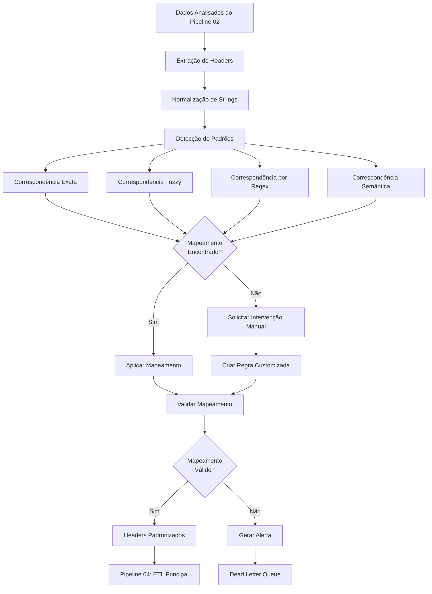

# Pipeline 03: Mapeamento de Headers

## 🎯 Objetivo

O Pipeline 03 é responsável por padronizar e mapear cabeçalhos de diferentes fontes de dados, garantindo que arquivos CSV de origens variadas possam ser processados de forma consistente pelo sistema ETL. Resolve problemas de nomenclatura inconsistente e garante compatibilidade entre diferentes formatos de entrada.

## 📊 Responsabilidades

### Detecção de Padrões
- Identificação automática de headers similares
- Reconhecimento de aliases e sinônimos
- Detecção de formatos regionais
- Análise de padrões de nomenclatura

### Mapeamento Inteligente
- Correspondência exata por nome
- Correspondência fuzzy por similaridade
- Mapeamento por expressões regulares
- Mapeamento por contexto semântico

### Resolução de Conflitos
- Detecção de ambiguidades
- Sugestões de mapeamento manual
- Histórico de mapeamentos aplicados
- Validação de mapeamentos customizados

## 🔄 Fluxo Detalhado



## 🗂️ Sistema de Mapeamento

### Estrutura de Dados

```sql
-- Tabela principal de mapeamentos
CREATE TABLE etl_header_mapping (
  id UUID PRIMARY KEY DEFAULT gen_random_uuid(),
  organization_id UUID NOT NULL REFERENCES organizations(id),

  source_header VARCHAR(255) NOT NULL,
  target_header VARCHAR(255) NOT NULL,
  mapping_type VARCHAR(50) NOT NULL, -- 'exact', 'fuzzy', 'regex', 'semantic', 'custom'

  confidence_score DECIMAL(3,2) CHECK (confidence_score BETWEEN 0 AND 1),
  similarity_score DECIMAL(3,2),

  pattern_regex VARCHAR(500),
  semantic_context JSONB,

  is_approved BOOLEAN DEFAULT FALSE,
  approved_by UUID REFERENCES users(id),
  approved_at TIMESTAMPTZ,

  usage_count INTEGER DEFAULT 0,
  last_used_at TIMESTAMPTZ,

  created_at TIMESTAMPTZ NOT NULL DEFAULT NOW(),
  updated_at TIMESTAMPTZ NOT NULL DEFAULT NOW(),

  UNIQUE(organization_id, source_header, target_header)
);

-- Índices para performance
CREATE INDEX idx_header_mapping_source ON etl_header_mapping(organization_id, source_header);
CREATE INDEX idx_header_mapping_target ON etl_header_mapping(target_header);
CREATE INDEX idx_header_mapping_type ON etl_header_mapping(mapping_type);
```

### Mapeamentos Padrão

```sql
-- Inserir mapeamentos padrão do sistema
INSERT INTO etl_header_mapping (
  organization_id, source_header, target_header, mapping_type, confidence_score, is_approved
) VALUES
-- Identificação de Animal
('00000000-0000-0000-0000-000000000000', 'id_animal', 'animal_id', 'exact', 1.0, true),
('00000000-0000-0000-0000-000000000000', 'codigo_animal', 'animal_id', 'semantic', 0.95, true),
('00000000-0000-0000-0000-000000000000', 'brinco', 'animal_id', 'semantic', 0.9, true),
('00000000-0000-0000-0000-000000000000', 'numero_brinco', 'animal_id', 'semantic', 0.9, true),

-- Peso
('00000000-0000-0000-0000-000000000000', 'peso_kg', 'weight_kg', 'exact', 1.0, true),
('00000000-0000-0000-0000-000000000000', 'peso', 'weight_kg', 'semantic', 0.95, true),
('00000000-0000-0000-0000-000000000000', 'weight', 'weight_kg', 'semantic', 0.9, true),
('00000000-0000-0000-0000-000000000000', 'peso_quilos', 'weight_kg', 'semantic', 0.9, true),

-- Data/Timestamp
('00000000-0000-0000-0000-000000000000', 'data_pesagem', 'measurement_date', 'exact', 1.0, true),
('00000000-0000-0000-0000-000000000000', 'data', 'measurement_date', 'semantic', 0.8, true),
('00000000-0000-0000-0000-000000000000', 'timestamp', 'measurement_date', 'semantic', 0.85, true),
('00000000-0000-0000-0000-000000000000', 'data_medicao', 'measurement_date', 'semantic', 0.95, true),

-- Fazenda/Local
('00000000-0000-0000-0000-000000000000', 'id_fazenda', 'farm_id', 'exact', 1.0, true),
('00000000-0000-0000-0000-000000000000', 'fazenda', 'farm_id', 'semantic', 0.9, true),
('00000000-0000-0000-0000-000000000000', 'propriedade', 'farm_id', 'semantic', 0.85, true),
('00000000-0000-0000-0000-000000000000', 'sitio', 'farm_id', 'semantic', 0.8, true);
```

## 🧠 Algoritmos de Mapeamento

### 1. Correspondência Exata

```typescript
export class ExactMatcher {
  async findExactMatches(
    sourceHeaders: string[],
    organizationId: string
  ): Promise<MappingResult[]> {
    const normalizedHeaders = sourceHeaders.map(header =>
      this.normalizeHeader(header)
    );

    const mappings = await this.db
      .select()
      .from('etl_header_mapping')
      .where('organization_id', organizationId)
      .where('mapping_type', 'exact')
      .whereIn('source_header', normalizedHeaders);

    return mappings.map(mapping => ({
      sourceHeader: mapping.source_header,
      targetHeader: mapping.target_header,
      mappingType: 'exact',
      confidenceScore: 1.0,
      similarityScore: 1.0
    }));
  }

  private normalizeHeader(header: string): string {
    return header
      .toLowerCase()
      .trim()
      .replace(/[^a-z0-9]/g, '_')
      .replace(/_+/g, '_')
      .replace(/^_|_$/g, '');
  }
}
```

### 2. Correspondência Fuzzy (Similaridade)

```typescript
import Fuse from 'fuse.js';
import { levenshteinDistance } from './string-utils';

export class FuzzyMatcher {
  private readonly SIMILARITY_THRESHOLD = 0.8;
  private readonly fuseOptions = {
    threshold: 0.3,
    includeScore: true,
    keys: ['source_header']
  };

  async findFuzzyMatches(
    sourceHeaders: string[],
    organizationId: string
  ): Promise<MappingResult[]> {
    const knownMappings = await this.getKnownMappings(organizationId);
    const fuse = new Fuse(knownMappings, this.fuseOptions);

    const results: MappingResult[] = [];

    for (const header of sourceHeaders) {
      const fuzzyResults = fuse.search(header);

      for (const result of fuzzyResults) {
        const similarityScore = 1 - (result.score || 0);

        if (similarityScore >= this.SIMILARITY_THRESHOLD) {
          // Calcular similaridade adicional com Levenshtein
          const levenshteinSimilarity = this.calculateLevenshteinSimilarity(
            header,
            result.item.source_header
          );

          const finalScore = (similarityScore + levenshteinSimilarity) / 2;

          results.push({
            sourceHeader: header,
            targetHeader: result.item.target_header,
            mappingType: 'fuzzy',
            confidenceScore: finalScore,
            similarityScore: finalScore,
            originalMatch: result.item.source_header
          });
        }
      }
    }

    return results.sort((a, b) => b.confidenceScore - a.confidenceScore);
  }

  private calculateLevenshteinSimilarity(str1: string, str2: string): number {
    const distance = levenshteinDistance(str1, str2);
    const maxLength = Math.max(str1.length, str2.length);
    return 1 - (distance / maxLength);
  }
}
```

### 3. Correspondência por Regex

```typescript
export class RegexMatcher {
  private readonly patterns: RegexPattern[] = [
    {
      name: 'animal_id_variants',
      pattern: /^(id|cod|codigo|num|numero)_?(animal|boi|gado|bovino)s?$/i,
      targetHeader: 'animal_id',
      confidence: 0.9
    },
    {
      name: 'weight_variants',
      pattern: /^(peso|weight|wt)_?(kg|quilos?|kilos?)?$/i,
      targetHeader: 'weight_kg',
      confidence: 0.85
    },
    {
      name: 'date_variants',
      pattern: /^(data|date|timestamp|ts)_?(pesagem|medicao|measurement)?$/i,
      targetHeader: 'measurement_date',
      confidence: 0.8
    },
    {
      name: 'farm_variants',
      pattern: /^(id|cod|codigo)_?(fazenda|farm|propriedade|sitio)$/i,
      targetHeader: 'farm_id',
      confidence: 0.85
    }
  ];

  async findRegexMatches(sourceHeaders: string[]): Promise<MappingResult[]> {
    const results: MappingResult[] = [];

    for (const header of sourceHeaders) {
      const normalizedHeader = this.normalizeHeader(header);

      for (const pattern of this.patterns) {
        if (pattern.pattern.test(normalizedHeader)) {
          results.push({
            sourceHeader: header,
            targetHeader: pattern.targetHeader,
            mappingType: 'regex',
            confidenceScore: pattern.confidence,
            similarityScore: pattern.confidence,
            patternName: pattern.name,
            regex: pattern.pattern.source
          });
          break; // Primeira correspondência vence
        }
      }
    }

    return results;
  }

  private normalizeHeader(header: string): string {
    return header
      .toLowerCase()
      .trim()
      .replace(/[^a-z0-9]/g, '_')
      .replace(/_+/g, '_');
  }
}

interface RegexPattern {
  name: string;
  pattern: RegExp;
  targetHeader: string;
  confidence: number;
}
```

### 4. Correspondência Semântica (NLP)

```typescript
import { OpenAI } from 'openai';

export class SemanticMatcher {
  private openai: OpenAI;
  private readonly SEMANTIC_THRESHOLD = 0.75;

  constructor() {
    this.openai = new OpenAI({
      apiKey: process.env.OPENAI_API_KEY
    });
  }

  async findSemanticMatches(
    sourceHeaders: string[],
    organizationId: string
  ): Promise<MappingResult[]> {
    const standardHeaders = await this.getStandardHeaders();
    const results: MappingResult[] = [];

    for (const header of sourceHeaders) {
      const embeddings = await this.generateEmbeddings([
        header,
        ...standardHeaders
      ]);

      const headerEmbedding = embeddings[0];
      const standardEmbeddings = embeddings.slice(1);

      for (let i = 0; i < standardHeaders.length; i++) {
        const similarity = this.calculateCosineSimilarity(
          headerEmbedding,
          standardEmbeddings[i]
        );

        if (similarity >= this.SEMANTIC_THRESHOLD) {
          results.push({
            sourceHeader: header,
            targetHeader: standardHeaders[i],
            mappingType: 'semantic',
            confidenceScore: similarity,
            similarityScore: similarity
          });
        }
      }
    }

    return results.sort((a, b) => b.confidenceScore - a.confidenceScore);
  }

  private async generateEmbeddings(texts: string[]): Promise<number[][]> {
    const response = await this.openai.embeddings.create({
      model: 'text-embedding-3-small',
      input: texts
    });

    return response.data.map(item => item.embedding);
  }

  private calculateCosineSimilarity(vecA: number[], vecB: number[]): number {
    const dotProduct = vecA.reduce((sum, a, i) => sum + a * vecB[i], 0);
    const magnitudeA = Math.sqrt(vecA.reduce((sum, a) => sum + a * a, 0));
    const magnitudeB = Math.sqrt(vecB.reduce((sum, b) => sum + b * b, 0));

    return dotProduct / (magnitudeA * magnitudeB);
  }

  private async getStandardHeaders(): Promise<string[]> {
    return [
      'animal_id',
      'weight_kg',
      'measurement_date',
      'farm_id',
      'operator_id',
      'feed_type',
      'feed_amount',
      'temperature',
      'humidity',
      'pen_id'
    ];
  }
}
```

## 🔧 Motor de Mapeamento Principal

```typescript
export class HeaderMappingEngine {
  private exactMatcher = new ExactMatcher();
  private fuzzyMatcher = new FuzzyMatcher();
  private regexMatcher = new RegexMatcher();
  private semanticMatcher = new SemanticMatcher();

  async mapHeaders(
    sourceHeaders: string[],
    organizationId: string
  ): Promise<HeaderMappingResult> {
    const mappingResults: MappingResult[] = [];
    const unmappedHeaders: string[] = [];
    const conflicts: MappingConflict[] = [];

    // 1. Tentar correspondência exata primeiro
    const exactMatches = await this.exactMatcher.findExactMatches(
      sourceHeaders, organizationId
    );
    mappingResults.push(...exactMatches);

    // 2. Headers não mapeados - tentar fuzzy matching
    const remainingHeaders = sourceHeaders.filter(
      header => !exactMatches.some(match => match.sourceHeader === header)
    );

    if (remainingHeaders.length > 0) {
      const fuzzyMatches = await this.fuzzyMatcher.findFuzzyMatches(
        remainingHeaders, organizationId
      );
      mappingResults.push(...fuzzyMatches);
    }

    // 3. Ainda não mapeados - tentar regex patterns
    const stillRemaining = remainingHeaders.filter(
      header => !mappingResults.some(match => match.sourceHeader === header)
    );

    if (stillRemaining.length > 0) {
      const regexMatches = await this.regexMatcher.findRegexMatches(
        stillRemaining
      );
      mappingResults.push(...regexMatches);
    }

    // 4. Último recurso - análise semântica (se habilitada)
    if (process.env.ENABLE_SEMANTIC_MATCHING === 'true') {
      const finalRemaining = stillRemaining.filter(
        header => !mappingResults.some(match => match.sourceHeader === header)
      );

      if (finalRemaining.length > 0) {
        const semanticMatches = await this.semanticMatcher.findSemanticMatches(
          finalRemaining, organizationId
        );
        mappingResults.push(...semanticMatches);
      }
    }

    // 5. Detectar conflitos e headers não mapeados
    const finalMapping = this.resolveConflicts(mappingResults);
    unmappedHeaders.push(
      ...sourceHeaders.filter(
        header => !finalMapping.some(mapping => mapping.sourceHeader === header)
      )
    );

    // 6. Atualizar estatísticas de uso
    await this.updateUsageStatistics(finalMapping, organizationId);

    return {
      mappings: finalMapping,
      unmappedHeaders,
      conflicts,
      totalHeaders: sourceHeaders.length,
      mappedHeaders: finalMapping.length,
      mappingRate: finalMapping.length / sourceHeaders.length
    };
  }

  private resolveConflicts(results: MappingResult[]): MappingResult[] {
    const groupedBySource = new Map<string, MappingResult[]>();

    // Agrupar por header de origem
    for (const result of results) {
      const existing = groupedBySource.get(result.sourceHeader) || [];
      existing.push(result);
      groupedBySource.set(result.sourceHeader, existing);
    }

    const resolved: MappingResult[] = [];

    // Resolver conflitos - manter o de maior confiança
    for (const [sourceHeader, candidates] of groupedBySource) {
      if (candidates.length === 1) {
        resolved.push(candidates[0]);
      } else {
        // Múltiplos candidatos - escolher o de maior confiança
        const best = candidates.reduce((prev, current) =>
          current.confidenceScore > prev.confidenceScore ? current : prev
        );
        resolved.push(best);
      }
    }

    return resolved;
  }
}

interface HeaderMappingResult {
  mappings: MappingResult[];
  unmappedHeaders: string[];
  conflicts: MappingConflict[];
  totalHeaders: number;
  mappedHeaders: number;
  mappingRate: number;
}

interface MappingResult {
  sourceHeader: string;
  targetHeader: string;
  mappingType: 'exact' | 'fuzzy' | 'regex' | 'semantic' | 'custom';
  confidenceScore: number;
  similarityScore: number;
  patternName?: string;
  regex?: string;
  originalMatch?: string;
}

interface MappingConflict {
  sourceHeader: string;
  candidates: MappingResult[];
  recommendedChoice: string;
  reason: string;
}
```

## 🎛️ Interface de Gerenciamento

### Componente React para Mapeamentos

```typescript
// src/components/mapping/HeaderMappingManager.tsx
export const HeaderMappingManager: React.FC = () => {
  const [mappings, setMappings] = useState<MappingResult[]>([]);
  const [unmappedHeaders, setUnmappedHeaders] = useState<string[]>([]);
  const [isLoading, setIsLoading] = useState(false);

  const handleAutoMapping = async (fileId: string) => {
    setIsLoading(true);
    try {
      const result = await headerMappingApi.autoMapHeaders(fileId);
      setMappings(result.mappings);
      setUnmappedHeaders(result.unmappedHeaders);
    } catch (error) {
      ETLSentryUtils.captureETLFileError(
        error as Error,
        fileId,
        'unknown',
        organizationId,
        'processing'
      );
    } finally {
      setIsLoading(false);
    }
  };

  const handleManualMapping = async (
    sourceHeader: string,
    targetHeader: string
  ) => {
    try {
      await headerMappingApi.createCustomMapping({
        sourceHeader,
        targetHeader,
        organizationId,
        mappingType: 'custom'
      });

      // Atualizar estado local
      setMappings(prev => [...prev, {
        sourceHeader,
        targetHeader,
        mappingType: 'custom',
        confidenceScore: 1.0,
        similarityScore: 1.0
      }]);

      setUnmappedHeaders(prev =>
        prev.filter(header => header !== sourceHeader)
      );
    } catch (error) {
      console.error('Erro ao criar mapeamento:', error);
    }
  };

  return (
    <div className="space-y-6">
      <div className="flex justify-between items-center">
        <h2 className="text-2xl font-bold">Mapeamento de Headers</h2>
        <Button
          onClick={() => handleAutoMapping(fileId)}
          disabled={isLoading}
        >
          {isLoading ? 'Mapeando...' : 'Auto Mapear'}
        </Button>
      </div>

      {/* Mapeamentos Detectados */}
      <Card>
        <CardHeader>
          <CardTitle>Mapeamentos Detectados</CardTitle>
        </CardHeader>
        <CardContent>
          <Table>
            <TableHeader>
              <TableRow>
                <TableHead>Header Original</TableHead>
                <TableHead>Header Padrão</TableHead>
                <TableHead>Tipo</TableHead>
                <TableHead>Confiança</TableHead>
                <TableHead>Ações</TableHead>
              </TableRow>
            </TableHeader>
            <TableBody>
              {mappings.map((mapping, index) => (
                <TableRow key={index}>
                  <TableCell>{mapping.sourceHeader}</TableCell>
                  <TableCell>{mapping.targetHeader}</TableCell>
                  <TableCell>
                    <Badge variant={getBadgeVariant(mapping.mappingType)}>
                      {mapping.mappingType}
                    </Badge>
                  </TableCell>
                  <TableCell>
                    <div className="flex items-center space-x-2">
                      <Progress
                        value={mapping.confidenceScore * 100}
                        className="w-20"
                      />
                      <span className="text-sm">
                        {Math.round(mapping.confidenceScore * 100)}%
                      </span>
                    </div>
                  </TableCell>
                  <TableCell>
                    <Button
                      variant="outline"
                      size="sm"
                      onClick={() => handleRejectMapping(mapping)}
                    >
                      Rejeitar
                    </Button>
                  </TableCell>
                </TableRow>
              ))}
            </TableBody>
          </Table>
        </CardContent>
      </Card>

      {/* Headers Não Mapeados */}
      {unmappedHeaders.length > 0 && (
        <Card>
          <CardHeader>
            <CardTitle>Headers Não Mapeados</CardTitle>
          </CardHeader>
          <CardContent>
            <div className="space-y-4">
              {unmappedHeaders.map((header) => (
                <UnmappedHeaderRow
                  key={header}
                  sourceHeader={header}
                  onManualMapping={handleManualMapping}
                />
              ))}
            </div>
          </CardContent>
        </Card>
      )}
    </div>
  );
};
```

## 📊 Métricas e Análise

### Dashboard de Mapeamentos

```sql
-- View para métricas de mapeamento
CREATE VIEW header_mapping_analytics AS
SELECT
  DATE_TRUNC('day', created_at) as date,
  organization_id,
  mapping_type,
  COUNT(*) as total_mappings,
  AVG(confidence_score) as avg_confidence,
  COUNT(*) FILTER (WHERE is_approved = true) as approved_mappings,
  COUNT(*) FILTER (WHERE usage_count > 0) as used_mappings,
  SUM(usage_count) as total_usage
FROM etl_header_mapping
GROUP BY date, organization_id, mapping_type;
```

### KPIs de Mapeamento

**Métricas de Eficácia:**
- Taxa de mapeamento automático vs manual
- Precisão dos algoritmos por tipo
- Tempo médio para resolução de conflitos
- Taxa de reaproveitamento de mapeamentos

**Métricas de Qualidade:**
- Distribuição de scores de confiança
- Headers mais problemáticos
- Padrões de nomenclatura por organização
- Evolução da qualidade dos mapeamentos

## 🔧 Configuração e Personalização

### Configuração por Organização

```sql
CREATE TABLE etl_mapping_config (
  id UUID PRIMARY KEY DEFAULT gen_random_uuid(),
  organization_id UUID NOT NULL REFERENCES organizations(id),

  enable_fuzzy_matching BOOLEAN DEFAULT TRUE,
  fuzzy_threshold DECIMAL(3,2) DEFAULT 0.8,

  enable_regex_matching BOOLEAN DEFAULT TRUE,
  custom_regex_patterns JSONB,

  enable_semantic_matching BOOLEAN DEFAULT FALSE,
  semantic_threshold DECIMAL(3,2) DEFAULT 0.75,

  auto_approve_high_confidence BOOLEAN DEFAULT FALSE,
  auto_approve_threshold DECIMAL(3,2) DEFAULT 0.95,

  created_at TIMESTAMPTZ NOT NULL DEFAULT NOW(),
  updated_at TIMESTAMPTZ NOT NULL DEFAULT NOW()
);
```

### Padrões Customizados

```yaml
# config/custom-patterns.yaml
organization_patterns:
  "fazenda-xyz":
    patterns:
      - name: "id_animal_fazenda_xyz"
        regex: "^BOVINO_[0-9]{4}_[A-Z]{2}$"
        target: "animal_id"
        confidence: 0.95

      - name: "peso_especial"
        regex: "^PESO_CORPORAL_(KG|QUILOS)$"
        target: "weight_kg"
        confidence: 0.9

  "cooperativa-abc":
    semantic_mappings:
      - source: "número identificação"
        target: "animal_id"
        confidence: 0.9

      - source: "massa corporal"
        target: "weight_kg"
        confidence: 0.85
```

---

**Pipeline Anterior**: [Pipeline 02 - Desvios de Carregamento](pipeline02-desvios.md)
**Próximo Pipeline**: [Pipeline 04 - ETL Principal](pipeline04-etl.md)