# Pipeline 04: ETL Principal

## 🎯 Objetivo

O Pipeline 04 é o estágio final do processamento ETL, responsável por realizar as transformações finais nos dados, enriquecê-los com informações contextuais e carregá-los no data warehouse. Este pipeline garante que os dados estejam prontos para análise de negócio e geração de insights.

## 📊 Responsabilidades

### Transformação de Dados
- Aplicação de regras de negócio complexas
- Cálculos derivados e métricas agregadas
- Normalização e padronização final
- Validação de integridade referencial

### Enriquecimento
- Integração com dados externos
- Adição de contexto geográfico e temporal
- Cálculo de indicadores de performance
- Correlação com dados históricos

### Carregamento
- Inserção no data warehouse
- Controle de versão de dados
- Otimização de performance
- Manutenção de índices e estatísticas

## 🔄 Fluxo Detalhado

```mermaid
flowchart TD
    A[Dados Mapeados do Pipeline 03] --> B[Validação de Integridade]
    B --> C[Transformações de Negócio]
    C --> D[Enriquecimento de Dados]

    D --> E[Cálculo de Métricas]
    E --> F[Validação Final]
    F --> G{Dados Válidos?}

    G -->|Não| H[Correção Automática]
    H --> I{Correção<br/>Possível?}
    I -->|Sim| F
    I -->|Não| J[Dead Letter Queue]

    G -->|Sim| K[Preparação para Carga]
    K --> L[Carregamento Incremental]
    L --> M[Atualização de Índices]
    M --> N[Verificação de Qualidade]

    N --> O{Qualidade OK?}
    O -->|Não| P[Rollback]
    O -->|Sim| Q[Commit Final]

    P --> J
    Q --> R[Notificação de Sucesso]
    J --> S[Alerta de Falha]
```



## 🔧 Transformações de Negócio

### 1. Cálculos de Performance Animal

```typescript
interface AnimalPerformanceMetrics {
  animalId: string;
  measurementDate: Date;

  // Métricas básicas
  currentWeight: number;
  previousWeight?: number;
  weightGain: number;
  dailyWeightGain: number;

  // Métricas de eficiência
  feedConversionRatio: number;
  feedEfficiency: number;
  growthRate: number;

  // Indicadores de saúde
  healthScore: number;
  nutritionalStatus: 'excelente' | 'bom' | 'regular' | 'preocupante';

  // Comparações
  performanceRank: number;
  groupAverage: number;
  expectedWeight: number;
  weightDeviation: number;
}
```

### Serviço de Transformação

```typescript
// packages/pipeline04-etl/src/transformations/business-transformer.ts
export class BusinessTransformer {
  async transformAnimalData(
    rawData: RawAnimalData[],
    organizationId: string
  ): Promise<TransformedAnimalData[]> {
    const transformedData: TransformedAnimalData[] = [];

    for (const record of rawData) {
      try {
        const transformed = await this.transformSingleRecord(record, organizationId);
        transformedData.push(transformed);
      } catch (error) {
        // Log error and send to DLQ
        await this.handleTransformationError(error, record, organizationId);
      }
    }

    return transformedData;
  }

  private async transformSingleRecord(
    record: RawAnimalData,
    organizationId: string
  ): Promise<TransformedAnimalData> {
    // 1. Buscar dados históricos do animal
    const historicalData = await this.getAnimalHistory(
      record.animalId,
      organizationId
    );

    // 2. Calcular métricas de performance
    const performanceMetrics = this.calculatePerformanceMetrics(
      record,
      historicalData
    );

    // 3. Enriquecer com dados contextuais
    const enrichedData = await this.enrichWithContext(
      record,
      organizationId
    );

    // 4. Validar regras de negócio
    await this.validateBusinessRules(record, performanceMetrics);

    // 5. Preparar dados finais
    return {
      ...record,
      ...performanceMetrics,
      ...enrichedData,
      processedAt: new Date(),
      processingVersion: this.getProcessingVersion()
    };
  }

  private calculatePerformanceMetrics(
    current: RawAnimalData,
    historical: HistoricalData[]
  ): AnimalPerformanceMetrics {
    const previousRecord = historical[0];
    const daysBetween = previousRecord
      ? this.daysBetween(previousRecord.measurementDate, current.measurementDate)
      : 0;

    const weightGain = previousRecord
      ? current.weight - previousRecord.weight
      : 0;

    const dailyWeightGain = daysBetween > 0
      ? weightGain / daysBetween
      : 0;

    // Calcular FCR (Feed Conversion Ratio)
    const feedConsumed = this.calculateFeedConsumption(current, historical);
    const feedConversionRatio = weightGain > 0
      ? feedConsumed / weightGain
      : 0;

    // Calcular taxa de crescimento
    const growthRate = previousRecord && previousRecord.weight > 0
      ? (weightGain / previousRecord.weight) * 100
      : 0;

    // Score de saúde baseado em múltiplos fatores
    const healthScore = this.calculateHealthScore(current, historical);

    return {
      animalId: current.animalId,
      measurementDate: current.measurementDate,
      currentWeight: current.weight,
      previousWeight: previousRecord?.weight,
      weightGain,
      dailyWeightGain,
      feedConversionRatio,
      feedEfficiency: feedConversionRatio > 0 ? 1 / feedConversionRatio : 0,
      growthRate,
      healthScore,
      nutritionalStatus: this.determineNutritionalStatus(healthScore),
      performanceRank: 0, // Calculado posteriormente
      groupAverage: 0,    // Calculado posteriormente
      expectedWeight: this.calculateExpectedWeight(current, historical),
      weightDeviation: 0  // Calculado posteriormente
    };
  }

  private calculateHealthScore(
    current: RawAnimalData,
    historical: HistoricalData[]
  ): number {
    let score = 100;

    // Penalizar por peso muito baixo ou muito alto
    const expectedWeight = this.calculateExpectedWeight(current, historical);
    const weightDeviation = Math.abs(current.weight - expectedWeight) / expectedWeight;

    if (weightDeviation > 0.2) score -= 20;
    else if (weightDeviation > 0.1) score -= 10;

    // Penalizar por ganho de peso inconsistente
    const recentGains = historical
      .slice(0, 5)
      .map(h => h.dailyWeightGain)
      .filter(gain => gain !== null);

    if (recentGains.length > 2) {
      const avgGain = recentGains.reduce((a, b) => a + b, 0) / recentGains.length;
      const variance = recentGains.reduce((sum, gain) =>
        sum + Math.pow(gain - avgGain, 2), 0
      ) / recentGains.length;

      if (variance > 0.5) score -= 15;
      else if (variance > 0.25) score -= 8;
    }

    // Penalizar por intervalos irregulares de medição
    const intervals = historical
      .slice(0, 10)
      .map((h, i) => {
        if (i === historical.length - 1) return null;
        return this.daysBetween(h.measurementDate, historical[i + 1].measurementDate);
      })
      .filter(interval => interval !== null);

    if (intervals.length > 2) {
      const avgInterval = intervals.reduce((a, b) => a + b, 0) / intervals.length;
      const intervalVariance = intervals.reduce((sum, interval) =>
        sum + Math.pow(interval - avgInterval, 2), 0
      ) / intervals.length;

      if (intervalVariance > 25) score -= 10;
      else if (intervalVariance > 16) score -= 5;
    }

    return Math.max(0, Math.min(100, score));
  }
}
```

### 2. Enriquecimento de Dados

```typescript
export class DataEnricher {
  async enrichWithContext(
    record: RawAnimalData,
    organizationId: string
  ): Promise<EnrichedData> {
    const [
      farmData,
      weatherData,
      marketData,
      breedData,
      nutritionData
    ] = await Promise.all([
      this.getFarmContext(record.farmId),
      this.getWeatherContext(record.measurementDate, record.farmId),
      this.getMarketContext(record.measurementDate),
      this.getBreedContext(record.animalId),
      this.getNutritionContext(record.animalId, record.measurementDate)
    ]);

    return {
      farm: farmData,
      weather: weatherData,
      market: marketData,
      breed: breedData,
      nutrition: nutritionData,
      enrichedAt: new Date()
    };
  }

  private async getWeatherContext(
    date: Date,
    farmId: string
  ): Promise<WeatherContext> {
    // Integração com API de clima
    const farm = await this.db
      .select()
      .from('farms')
      .where('id', farmId)
      .first();

    if (!farm?.latitude || !farm?.longitude) {
      return { available: false };
    }

    try {
      const weather = await this.weatherApi.getHistoricalWeather({
        lat: farm.latitude,
        lon: farm.longitude,
        date: date.toISOString().split('T')[0]
      });

      return {
        available: true,
        temperature: weather.temperature,
        humidity: weather.humidity,
        precipitation: weather.precipitation,
        windSpeed: weather.windSpeed,
        heatIndex: this.calculateHeatIndex(weather.temperature, weather.humidity),
        stressLevel: this.calculateHeatStress(weather.temperature, weather.humidity)
      };
    } catch (error) {
      console.warn('Erro ao buscar dados meteorológicos:', error);
      return { available: false };
    }
  }

  private async getMarketContext(date: Date): Promise<MarketContext> {
    // Buscar preços de commodities próximos à data
    const marketData = await this.db
      .select()
      .from('market_prices')
      .where('price_date', '<=', date)
      .orderBy('price_date', 'desc')
      .limit(1)
      .first();

    if (!marketData) {
      return { available: false };
    }

    return {
      available: true,
      beefPrice: marketData.beef_price_per_kg,
      cornPrice: marketData.corn_price_per_ton,
      soybeanPrice: marketData.soybean_price_per_ton,
      feedCostIndex: marketData.feed_cost_index,
      profitabilityIndex: this.calculateProfitabilityIndex(marketData)
    };
  }

  private async getNutritionContext(
    animalId: string,
    date: Date
  ): Promise<NutritionContext> {
    // Buscar dados de alimentação dos últimos 30 dias
    const feedingData = await this.db
      .select()
      .from('animal_feeding')
      .where('animal_id', animalId)
      .whereBetween('feeding_date', [
        new Date(date.getTime() - 30 * 24 * 60 * 60 * 1000),
        date
      ])
      .orderBy('feeding_date', 'desc');

    if (feedingData.length === 0) {
      return { available: false };
    }

    const totalFeed = feedingData.reduce((sum, feed) => sum + feed.amount_kg, 0);
    const avgDailyFeed = totalFeed / 30;

    const nutritionBreakdown = this.calculateNutritionBreakdown(feedingData);

    return {
      available: true,
      averageDailyFeed: avgDailyFeed,
      totalFeedPeriod: totalFeed,
      feedTypes: [...new Set(feedingData.map(f => f.feed_type))],
      nutritionBreakdown,
      supplementsUsed: feedingData
        .filter(f => f.supplement_type)
        .map(f => f.supplement_type)
    };
  }
}
```

## 📊 Sistema de Carga Incremental

### Estratégia de Carregamento

```typescript
export class IncrementalLoader {
  async loadData(
    transformedData: TransformedAnimalData[],
    organizationId: string
  ): Promise<LoadResult> {
    const transaction = await this.db.transaction();

    try {
      // 1. Identificar registros novos vs atualizações
      const { newRecords, updates } = await this.categorizeRecords(
        transformedData,
        organizationId
      );

      // 2. Carregar novos registros
      const insertResult = await this.insertNewRecords(newRecords, transaction);

      // 3. Atualizar registros existentes
      const updateResult = await this.updateExistingRecords(updates, transaction);

      // 4. Atualizar tabelas agregadas
      await this.updateAggregatedTables(transformedData, transaction);

      // 5. Atualizar índices e estatísticas
      await this.updateIndexes(transaction);

      // 6. Executar validações finais
      const validationResult = await this.validateDataIntegrity(transaction);

      if (!validationResult.isValid) {
        await transaction.rollback();
        throw new Error(`Validação falhou: ${validationResult.errors.join(', ')}`);
      }

      await transaction.commit();

      return {
        success: true,
        recordsInserted: insertResult.count,
        recordsUpdated: updateResult.count,
        processingTime: Date.now() - startTime,
        validationPassed: true
      };

    } catch (error) {
      await transaction.rollback();
      throw error;
    }
  }

  private async categorizeRecords(
    data: TransformedAnimalData[],
    organizationId: string
  ): Promise<{ newRecords: TransformedAnimalData[], updates: TransformedAnimalData[] }> {
    const existingRecords = await this.db
      .select('animal_id', 'measurement_date')
      .from('animal_measurements')
      .where('organization_id', organizationId)
      .whereIn(
        ['animal_id', 'measurement_date'],
        data.map(d => [d.animalId, d.measurementDate])
      );

    const existingKeys = new Set(
      existingRecords.map(r => `${r.animal_id}:${r.measurement_date}`)
    );

    const newRecords: TransformedAnimalData[] = [];
    const updates: TransformedAnimalData[] = [];

    for (const record of data) {
      const key = `${record.animalId}:${record.measurementDate}`;
      if (existingKeys.has(key)) {
        updates.push(record);
      } else {
        newRecords.push(record);
      }
    }

    return { newRecords, updates };
  }

  private async updateAggregatedTables(
    data: TransformedAnimalData[],
    transaction: Transaction
  ): Promise<void> {
    // Atualizar tabela de métricas diárias
    await this.updateDailyMetrics(data, transaction);

    // Atualizar tabela de performance por animal
    await this.updateAnimalPerformance(data, transaction);

    // Atualizar rankings
    await this.updatePerformanceRankings(data, transaction);
  }

  private async updateDailyMetrics(
    data: TransformedAnimalData[],
    transaction: Transaction
  ): Promise<void> {
    const dailyAggregates = this.aggregateByDay(data);

    for (const [date, metrics] of dailyAggregates) {
      await transaction
        .insert({
          organization_id: data[0].organizationId,
          measurement_date: date,
          total_animals: metrics.animalCount,
          average_weight: metrics.avgWeight,
          total_weight_gain: metrics.totalWeightGain,
          average_daily_gain: metrics.avgDailyGain,
          feed_conversion_ratio: metrics.avgFCR,
          health_score_avg: metrics.avgHealthScore,
          created_at: new Date(),
          updated_at: new Date()
        })
        .into('daily_metrics')
        .onConflict(['organization_id', 'measurement_date'])
        .merge([
          'total_animals',
          'average_weight',
          'total_weight_gain',
          'average_daily_gain',
          'feed_conversion_ratio',
          'health_score_avg',
          'updated_at'
        ]);
    }
  }
}
```

## 🔄 Sistema de Retry e Dead Letter Queue

### Configuração de Retry

```typescript
// packages/pipeline04-etl/src/retry/retry-config.ts
export interface RetryConfig {
  maxRetries: number;
  baseDelayMs: number;
  maxDelayMs: number;
  backoffMultiplier: number;
  jitterMaxMs: number;
  retryableErrors: string[];
}

export const DEFAULT_RETRY_CONFIG: RetryConfig = {
  maxRetries: 3,
  baseDelayMs: 1000,
  maxDelayMs: 30000,
  backoffMultiplier: 2,
  jitterMaxMs: 500,
  retryableErrors: [
    'ECONNRESET',
    'ETIMEDOUT',
    'ENOTFOUND',
    'SequelizeConnectionError',
    'SequelizeTimeoutError'
  ]
};

export class RetryLogicService {
  async executeWithRetry<T>(
    operation: () => Promise<T>,
    entityType: 'etl_file' | 'etl_run',
    entityId: string,
    organizationId: string,
    config: Partial<RetryConfig> = {}
  ): Promise<RetryResult<T>> {
    const finalConfig = { ...DEFAULT_RETRY_CONFIG, ...config };
    let lastError: Error;

    for (let attempt = 1; attempt <= finalConfig.maxRetries + 1; attempt++) {
      try {
        const result = await operation();

        // Log successful retry if this wasn't the first attempt
        if (attempt > 1) {
          console.log(`Operação bem-sucedida na tentativa ${attempt}`, {
            entityType,
            entityId,
            organizationId,
            totalAttempts: attempt
          });
        }

        return {
          success: true,
          result,
          attempts: attempt,
          totalDuration: Date.now() - startTime
        };

      } catch (error) {
        lastError = error as Error;

        // Verificar se erro é retryable
        if (!this.isRetryableError(lastError, finalConfig)) {
          throw lastError;
        }

        // Se não há mais tentativas, não delay
        if (attempt > finalConfig.maxRetries) {
          break;
        }

        // Calcular delay com exponential backoff + jitter
        const delay = this.calculateDelay(attempt, finalConfig);

        console.warn(`Tentativa ${attempt} falhou, tentando novamente em ${delay}ms`, {
          entityType,
          entityId,
          organizationId,
          error: lastError.message,
          nextAttemptIn: delay
        });

        await this.sleep(delay);
      }
    }

    // Todas as tentativas falharam - enviar para DLQ
    await this.sendToDeadLetterQueue(
      entityType,
      entityId,
      organizationId,
      lastError,
      finalConfig.maxRetries + 1
    );

    return {
      success: false,
      error: lastError,
      attempts: finalConfig.maxRetries + 1,
      sentToDLQ: true
    };
  }

  private async sendToDeadLetterQueue(
    entityType: 'etl_file' | 'etl_run',
    entityId: string,
    organizationId: string,
    error: Error,
    attempts: number
  ): Promise<void> {
    const errorType = this.classifyError(error);

    await this.db.insert({
      id: generateUUID(),
      entity_type: entityType,
      entity_id: entityId,
      organization_id: organizationId,
      error_type: errorType,
      error_message: error.message,
      error_details: {
        stack: error.stack,
        name: error.name,
        attempts,
        timestamp: new Date().toISOString()
      },
      retry_count: 0,
      max_retries: 3,
      resolved: false,
      created_at: new Date()
    }).into('etl_dead_letter_queue');

    // Notificar sobre entrada na DLQ
    await this.notificationService.sendDLQAlert({
      entityType,
      entityId,
      organizationId,
      errorType,
      errorMessage: error.message
    });
  }

  private classifyError(error: Error): ErrorType {
    const message = error.message.toLowerCase();
    const name = error.name.toLowerCase();

    if (message.includes('timeout') || name.includes('timeout')) {
      return 'timeout';
    }

    if (message.includes('connection') || name.includes('connection')) {
      return 'connection';
    }

    if (message.includes('validation') || message.includes('constraint')) {
      return 'validation';
    }

    if (message.includes('rate limit') || message.includes('429')) {
      return 'rate_limited';
    }

    if (message.includes('memory') || message.includes('resource')) {
      return 'resource';
    }

    return 'unknown';
  }
}

type ErrorType = 'timeout' | 'connection' | 'validation' | 'rate_limited' | 'resource' | 'unknown';
```

## 📈 Monitoramento e Observabilidade

### Métricas de Performance

```typescript
export class ETLMetricsCollector {
  private static instance: ETLMetricsCollector;
  private metricsBuffer: ETLMetric[] = [];
  private readonly FLUSH_INTERVAL = 30000; // 30 segundos
  private readonly BUFFER_SIZE = 100;

  async recordProcessingMetric(
    organizationId: string,
    entityType: 'file' | 'run',
    entityId: string,
    stage: string,
    durationMs: number,
    recordCount: number,
    success: boolean,
    metadata?: Record<string, any>
  ): Promise<void> {
    const metric: ETLMetric = {
      id: generateUUID(),
      organization_id: organizationId,
      metric_type: 'processing_time',
      metric_name: `${stage}_duration`,
      metric_value: durationMs,
      metric_unit: 'milliseconds',
      entity_type: entityType,
      entity_id: entityId,
      tags: {
        stage,
        success: success.toString(),
        record_count: recordCount.toString()
      },
      metadata: {
        ...metadata,
        timestamp: new Date().toISOString()
      },
      recorded_at: new Date()
    };

    this.metricsBuffer.push(metric);

    // Flush se buffer estiver cheio
    if (this.metricsBuffer.length >= this.BUFFER_SIZE) {
      await this.flushMetrics();
    }
  }

  async recordQualityMetric(
    organizationId: string,
    qualityScore: number,
    validRecords: number,
    totalRecords: number,
    entityId: string
  ): Promise<void> {
    const qualityRate = totalRecords > 0 ? (validRecords / totalRecords) * 100 : 0;

    await this.recordProcessingMetric(
      organizationId,
      'file',
      entityId,
      'quality_check',
      0,
      totalRecords,
      qualityRate >= 95,
      {
        quality_score: qualityScore,
        valid_records: validRecords,
        quality_rate: qualityRate
      }
    );
  }

  private async flushMetrics(): Promise<void> {
    if (this.metricsBuffer.length === 0) return;

    const metricsToFlush = [...this.metricsBuffer];
    this.metricsBuffer = [];

    try {
      await this.db.batchInsert('etl_metrics', metricsToFlush, 50);
    } catch (error) {
      console.error('Erro ao salvar métricas:', error);
      // Re-adicionar métricas ao buffer para retry
      this.metricsBuffer.unshift(...metricsToFlush);
    }
  }
}
```

### Dashboard de Pipeline

```sql
-- Views para dashboard de performance
CREATE VIEW pipeline_performance_summary AS
SELECT
  organization_id,
  DATE_TRUNC('hour', recorded_at) as hour,
  metric_name,
  COUNT(*) as metric_count,
  AVG(metric_value) as avg_value,
  MIN(metric_value) as min_value,
  MAX(metric_value) as max_value,
  PERCENTILE_CONT(0.5) WITHIN GROUP (ORDER BY metric_value) as median_value,
  PERCENTILE_CONT(0.95) WITHIN GROUP (ORDER BY metric_value) as p95_value,
  COUNT(*) FILTER (WHERE tags->>'success' = 'true') as success_count,
  COUNT(*) FILTER (WHERE tags->>'success' = 'false') as failure_count
FROM etl_metrics
WHERE metric_type = 'processing_time'
GROUP BY organization_id, hour, metric_name;

CREATE VIEW data_quality_trends AS
SELECT
  organization_id,
  DATE_TRUNC('day', recorded_at) as date,
  AVG(CAST(metadata->>'quality_rate' AS DECIMAL)) as avg_quality_rate,
  MIN(CAST(metadata->>'quality_rate' AS DECIMAL)) as min_quality_rate,
  MAX(CAST(metadata->>'quality_rate' AS DECIMAL)) as max_quality_rate,
  COUNT(*) as files_processed,
  COUNT(*) FILTER (WHERE CAST(metadata->>'quality_rate' AS DECIMAL) >= 95) as high_quality_files
FROM etl_metrics
WHERE metric_name = 'quality_check_duration'
GROUP BY organization_id, date;
```

## 🧪 Testes e Validação

### Testes de Integração

```typescript
// packages/pipeline04-etl/tests/integration/pipeline.test.ts
describe('Pipeline 04 Integration Tests', () => {
  beforeEach(async () => {
    await setupTestDatabase();
    await seedTestData();
  });

  afterEach(async () => {
    await cleanupTestDatabase();
  });

  describe('End-to-End Processing', () => {
    it('should process a complete file successfully', async () => {
      // Arrange
      const testFile = await createTestFile({
        organizationId: TEST_ORG_ID,
        animalCount: 100,
        hasWeatherData: true,
        hasMarketData: true
      });

      // Act
      const result = await pipeline04.processFile(testFile.id);

      // Assert
      expect(result.success).toBe(true);
      expect(result.recordsProcessed).toBe(100);
      expect(result.qualityScore).toBeGreaterThan(95);

      // Verificar dados carregados
      const loadedData = await db
        .select()
        .from('animal_measurements')
        .where('file_id', testFile.id);

      expect(loadedData).toHaveLength(100);

      // Verificar enriquecimento
      const enrichedRecord = loadedData[0];
      expect(enrichedRecord.weather_data).toBeDefined();
      expect(enrichedRecord.market_data).toBeDefined();
      expect(enrichedRecord.performance_metrics).toBeDefined();
    });

    it('should handle transformation errors gracefully', async () => {
      // Arrange
      const testFile = await createTestFile({
        organizationId: TEST_ORG_ID,
        hasInvalidData: true,
        invalidRecordCount: 10
      });

      // Act
      const result = await pipeline04.processFile(testFile.id);

      // Assert
      expect(result.success).toBe(true);
      expect(result.recordsProcessed).toBe(90); // 10 invalid records
      expect(result.dlqEntries).toBe(10);

      // Verificar DLQ
      const dlqEntries = await db
        .select()
        .from('etl_dead_letter_queue')
        .where('entity_id', testFile.id);

      expect(dlqEntries).toHaveLength(10);
    });
  });

  describe('Performance Tests', () => {
    it('should process large files within SLA', async () => {
      // Arrange
      const largeFile = await createTestFile({
        organizationId: TEST_ORG_ID,
        animalCount: 10000
      });

      const startTime = Date.now();

      // Act
      const result = await pipeline04.processFile(largeFile.id);

      const processingTime = Date.now() - startTime;

      // Assert
      expect(result.success).toBe(true);
      expect(processingTime).toBeLessThan(120000); // 2 minutos SLA
    });

    it('should handle concurrent file processing', async () => {
      // Arrange
      const files = await Promise.all([
        createTestFile({ organizationId: TEST_ORG_ID, animalCount: 500 }),
        createTestFile({ organizationId: TEST_ORG_ID, animalCount: 750 }),
        createTestFile({ organizationId: TEST_ORG_ID, animalCount: 300 })
      ]);

      // Act
      const results = await Promise.all(
        files.map(file => pipeline04.processFile(file.id))
      );

      // Assert
      results.forEach(result => {
        expect(result.success).toBe(true);
      });

      // Verificar não há conflitos de dados
      const allRecords = await db
        .select()
        .from('animal_measurements')
        .whereIn('file_id', files.map(f => f.id));

      expect(allRecords).toHaveLength(1550); // 500 + 750 + 300
    });
  });
});
```

## 🔧 Configuração e Otimização

### Configuração de Performance

```yaml
# config/pipeline04.yaml
processing:
  batch_size: 1000
  max_concurrent_files: 5
  max_concurrent_transforms: 10

  # Timeouts
  transformation_timeout_ms: 300000  # 5 minutos
  enrichment_timeout_ms: 120000     # 2 minutos
  loading_timeout_ms: 600000        # 10 minutos

database:
  pool_size: 20
  max_connections: 50
  query_timeout_ms: 30000

  # Bulk operations
  batch_insert_size: 500
  bulk_update_size: 200

retry:
  max_retries: 3
  base_delay_ms: 1000
  max_delay_ms: 30000
  backoff_multiplier: 2

monitoring:
  metrics_flush_interval_ms: 30000
  health_check_interval_ms: 60000
  alert_thresholds:
    processing_time_p95_ms: 180000
    error_rate_percent: 5
    quality_score_min: 90
```

### Otimizações de Banco

```sql
-- Índices para performance
CREATE INDEX CONCURRENTLY idx_animal_measurements_org_date
ON animal_measurements(organization_id, measurement_date);

CREATE INDEX CONCURRENTLY idx_animal_measurements_animal_date
ON animal_measurements(animal_id, measurement_date);

CREATE INDEX CONCURRENTLY idx_etl_metrics_org_recorded
ON etl_metrics(organization_id, recorded_at);

-- Particionamento por data
CREATE TABLE animal_measurements_partitioned (
  LIKE animal_measurements INCLUDING ALL
) PARTITION BY RANGE (measurement_date);

-- Partições mensais
CREATE TABLE animal_measurements_y2025m01
PARTITION OF animal_measurements_partitioned
FOR VALUES FROM ('2025-01-01') TO ('2025-02-01');

-- Função para criação automática de partições
CREATE OR REPLACE FUNCTION create_monthly_partition(
  table_name TEXT,
  start_date DATE
) RETURNS void AS $$
DECLARE
  partition_name TEXT;
  end_date DATE;
BEGIN
  partition_name := table_name || '_y' || EXTRACT(year FROM start_date) ||
                   'm' || LPAD(EXTRACT(month FROM start_date)::TEXT, 2, '0');
  end_date := start_date + INTERVAL '1 month';

  EXECUTE format('CREATE TABLE %I PARTITION OF %I FOR VALUES FROM (%L) TO (%L)',
                 partition_name, table_name, start_date, end_date);
END;
$$ LANGUAGE plpgsql;
```

---

**Pipeline Anterior**: [Pipeline 03 - Mapeamento de Headers](pipeline03-mapping.md)
**Documentação Principal**: [Visão Geral dos Pipelines](overview.md)